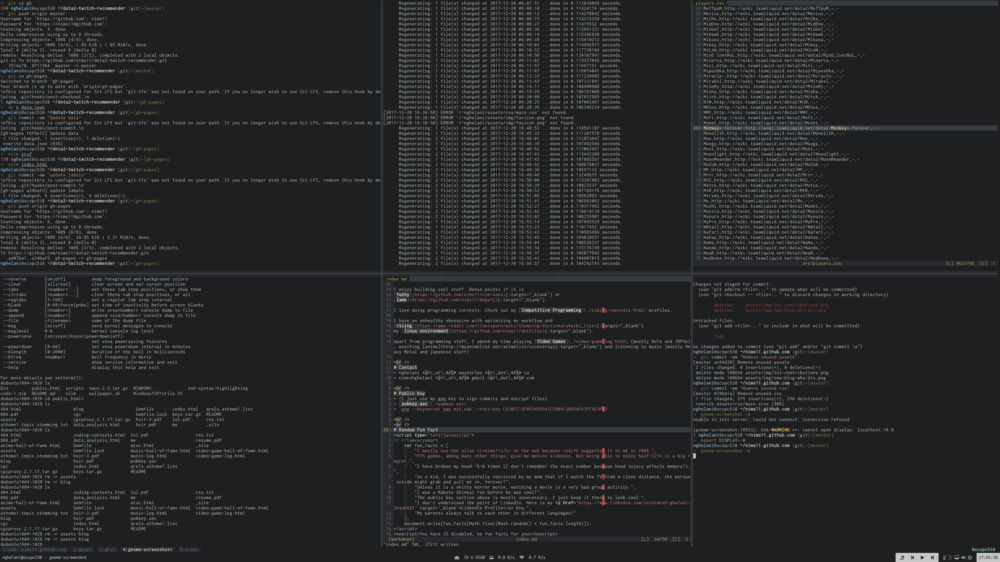

- My [dotfiles](https://github.com/nims11/dotfiles)
- I have a 16 color palette in .Xresources and try my best to keep my vim, tmux, st, zsh and i3 faithful it it.
- The looks and config are consistent and synced across my school desktop and personal laptop.
- A wild screenshot:

- That cool bar in the bottom is [my lemonbar fork](https://github.com/nims11/bar) with mouse hover support. It works but is an [ugly hack](https://github.com/krypt-n/bar/pull/30). Here is the [bar generator script](https://github.com/nims11/dotfiles/blob/master/.config/panel/lbar.py).
